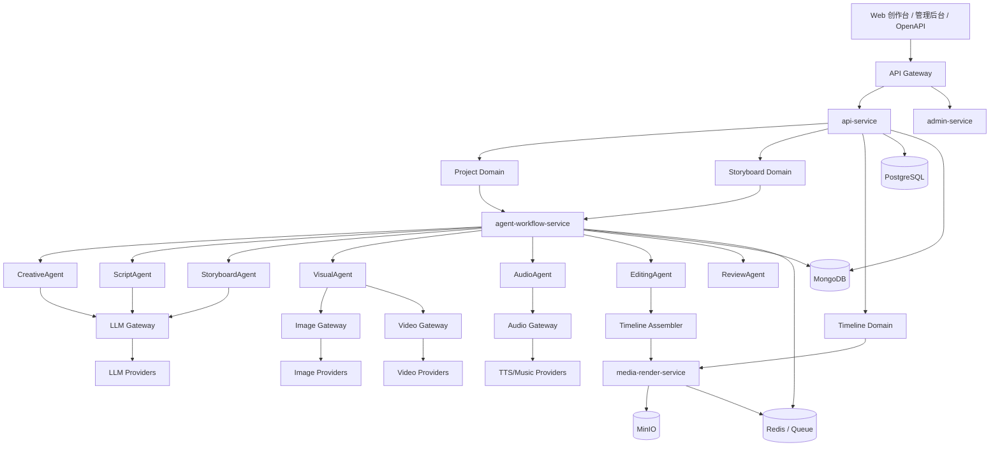
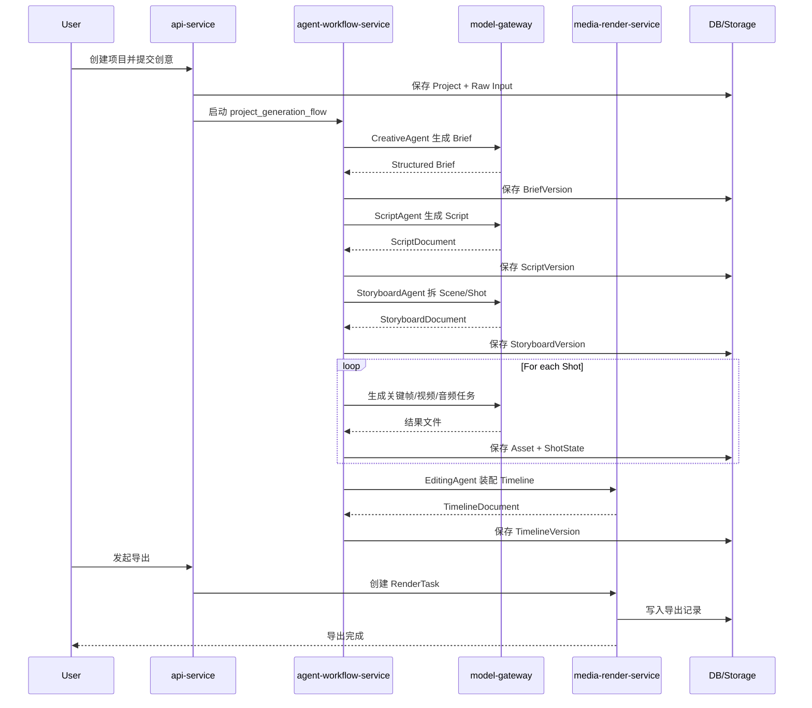
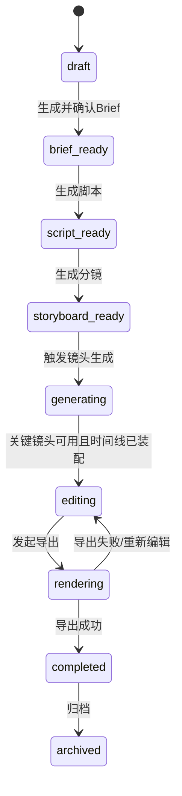
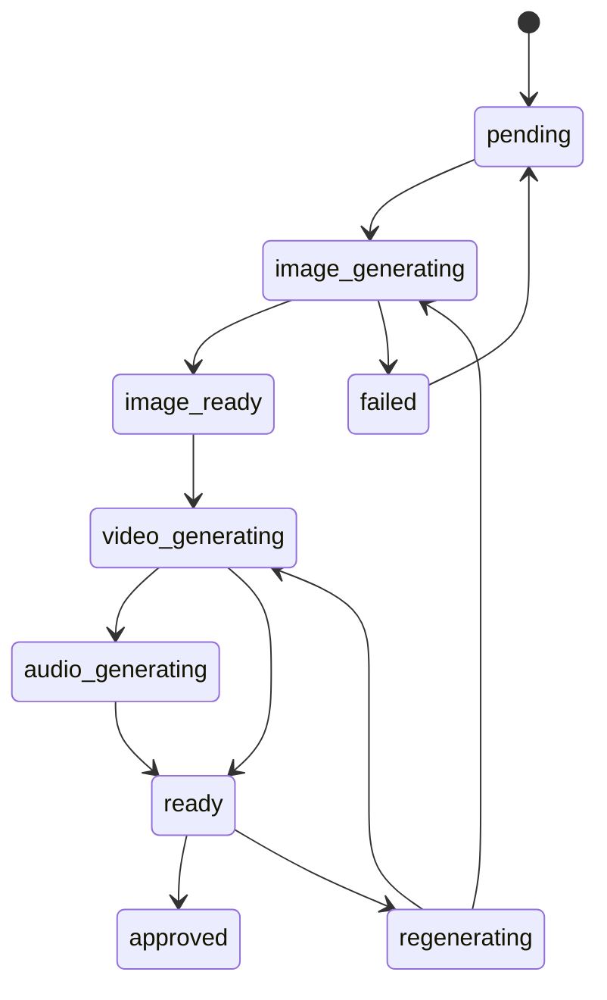
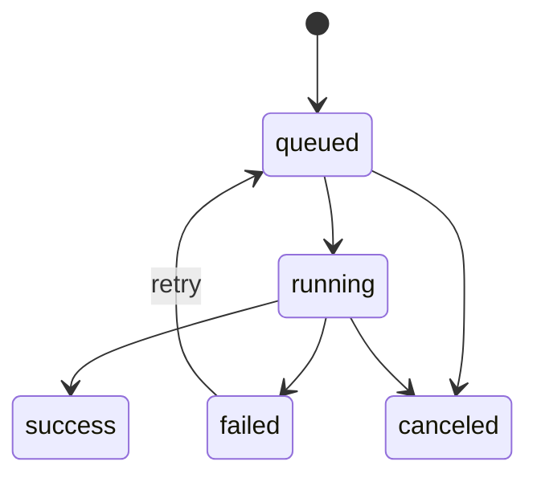

当前处于只读计划模式，不能直接写入文件。下面内容可直接作为 `docs/系统设计 2.md` 正文。

---

# 系统设计 2

## 1. 文档目标

本文面向“AI 多智能体视频制作平台”的 MVP 阶段，输出 5 类设计内容：

1. MVP 模块清单 + 服务目录结构
2. 数据库表结构 / 文档结构设计
3. 系统架构图（正式版）
4. 接口设计清单（REST API）
5. 工作流状态机设计

本文设计目标不是一次性做成完整 Flova，而是优先实现：

1. 创意输入
2. Brief 结构化
3. 脚本生成
4. Storyboard 拆解
5. 单镜头图像/视频生成
6. 配音/字幕生成
7. 时间线装配
8. 成片导出
9. Shot 级重生成
10. 项目级版本管理

---

## 2. 设计原则

1. 以 `Project` 为业务聚合根
2. 以 `Workflow + Agent` 为系统控制中枢
3. 以 `Shot` 为最小生产与重算单元
4. 以 `Timeline` 为成片装配对象，而不是直接用 Shot 列表替代
5. 所有生成类任务默认异步
6. 每个阶段必须支持回退、替换、局部重算
7. 先做“可生产平台”，后做“重剪辑器”

---

## 3. MVP 模块清单

### 3.1 用户侧模块

1. 项目中心
- 新建项目
- 项目列表
- 项目详情
- 项目归档
- 项目复制
- 项目版本快照

2. 创意输入
- 文本输入
- 脚本上传
- 参考图/视频/音频上传
- Creative Brief 自动生成
- Brief 手动编辑与确认

3. 脚本模块
- 脚本生成
- 脚本版本管理
- 脚本编辑
- 脚本重生成

4. 分镜模块
- Scene / Shot 自动拆分
- Shot 增删改
- Shot Prompt 编辑
- 镜头时长调整
- 模型选择

5. 媒体生成模块
- 关键帧生成
- 视频片段生成
- TTS 配音生成
- 字幕生成
- 单镜头重生成
- 候选结果收藏

6. 时间线模块
- 自动装配 Timeline
- 视频轨编辑
- 音频轨编辑
- 字幕轨编辑
- 片段裁剪与替换
- BGM 音量压制

7. 导出模块
- 成片预览
- MP4 导出
- 封面导出
- 导出记录
- 导出下载

### 3.2 管理侧模块

1. 模型中心
- LLM 配置
- 图像模型配置
- 视频模型配置
- TTS 配置
- 路由与降级策略

2. 任务监控
- 工作流任务列表
- 镜头生成任务
- 导出任务
- 失败任务重试/取消

3. 租户与权限
- 企业租户
- 用户角色
- 项目成员
- 配额策略

4. 审计与成本
- 操作日志
- 模型调用日志
- 任务耗时
- 费用统计

### 3.3 系统内部模块

1. Project Domain
2. Brief Domain
3. Script Domain
4. Storyboard Domain
5. Asset Domain
6. Timeline Domain
7. Workflow Domain
8. Agent Domain
9. Render Domain
10. Admin Domain

---

## 4. MVP 服务划分

MVP 推荐采用“逻辑 6 域、部署 4 服务”的折中方案。

### 4.1 逻辑域

1. Project / Brief / Script
2. Storyboard
3. Workflow / Agent
4. Asset / Media
5. Timeline / Render
6. Admin / Billing / Audit

### 4.2 部署服务

1. `api-service`
- 对外 REST API
- 鉴权
- 项目查询
- 聚合读接口

2. `agent-workflow-service`
- Agent 编排
- 工作流状态机
- 任务下发
- 回滚与局部重算

3. `media-render-service`
- 素材上传
- 图像/视频/音频结果管理
- Timeline 装配
- FFmpeg 导出

4. `admin-service`
- 模型配置
- 配额
- 审计
- 任务监控

---

## 5. 服务目录结构

推荐采用 Monorepo。

```text
ai-video-studio/
├── services/
│   ├── api-service/
│   │   ├── app/
│   │   │   ├── api/
│   │   │   │   ├── v1/
│   │   │   │   │   ├── auth.py
│   │   │   │   │   ├── projects.py
│   │   │   │   │   ├── briefs.py
│   │   │   │   │   ├── scripts.py
│   │   │   │   │   ├── storyboards.py
│   │   │   │   │   ├── shots.py
│   │   │   │   │   ├── assets.py
│   │   │   │   │   ├── timelines.py
│   │   │   │   │   ├── renders.py
│   │   │   │   │   └── tasks.py
│   │   │   ├── schemas/
│   │   │   ├── assemblers/
│   │   │   ├── clients/
│   │   │   └── main.py
│   │   └── tests/
│   ├── agent-workflow-service/
│   │   ├── app/
│   │   │   ├── agents/
│   │   │   │   ├── creative_agent.py
│   │   │   │   ├── script_agent.py
│   │   │   │   ├── storyboard_agent.py
│   │   │   │   ├── character_agent.py
│   │   │   │   ├── visual_agent.py
│   │   │   │   ├── audio_agent.py
│   │   │   │   ├── editing_agent.py
│   │   │   │   └── review_agent.py
│   │   │   ├── workflows/
│   │   │   │   ├── project_generation_flow.py
│   │   │   │   ├── shot_regeneration_flow.py
│   │   │   │   └── export_flow.py
│   │   │   ├── state_machine/
│   │   │   ├── gateways/
│   │   │   ├── tasks/
│   │   │   └── main.py
│   │   └── tests/
│   ├── media-render-service/
│   │   ├── app/
│   │   │   ├── assets/
│   │   │   ├── subtitles/
│   │   │   ├── timeline/
│   │   │   ├── render/
│   │   │   ├── ffmpeg/
│   │   │   └── main.py
│   │   └── tests/
│   └── admin-service/
│       ├── app/
│       │   ├── model_center/
│       │   ├── quotas/
│       │   ├── audit/
│       │   ├── billing/
│       │   └── main.py
│       └── tests/
├── packages/
│   ├── domain/
│   │   ├── project/
│   │   ├── storyboard/
│   │   ├── timeline/
│   │   └── task/
│   ├── repositories/
│   ├── events/
│   ├── contracts/
│   ├── common/
│   └── model_gateways/
│       ├── llm_gateway.py
│       ├── image_gateway.py
│       ├── video_gateway.py
│       └── audio_gateway.py
├── deployments/
│   ├── docker/
│   └── k8s/
├── docs/
└── scripts/
```

---

## 6. 正式系统架构图

### 6.1 分层架构图



### 6.2 核心时序图



---

## 7. 数据存储设计

推荐采用混合存储。

### 7.1 PostgreSQL

用于强事务、关系数据、查询统计、权限与任务元数据。

### 7.2 MongoDB

用于创意、脚本、分镜、时间线、Agent 中间结果等文档型结构。

### 7.3 Redis

用于队列、缓存、分布式锁、任务状态与幂等控制。

### 7.4 MinIO

用于图片、视频、音频、字幕、封面、导出文件等二进制资产。

---

## 8. PostgreSQL 表结构设计

### 8.1 `tenant`

| 字段 | 类型 | 说明 |
|---|---|---|
| id | bigint pk | 租户 ID |
| code | varchar(64) unique | 租户编码 |
| name | varchar(128) | 租户名称 |
| plan_type | varchar(32) | 套餐类型 |
| status | varchar(32) | active/suspended |
| created_at | timestamptz | 创建时间 |
| updated_at | timestamptz | 更新时间 |

### 8.2 `user_account`

| 字段 | 类型 | 说明 |
|---|---|---|
| id | bigint pk | 用户 ID |
| tenant_id | bigint | 租户 ID |
| email | varchar(128) | 邮箱 |
| mobile | varchar(32) | 手机号 |
| display_name | varchar(64) | 昵称 |
| role | varchar(32) | owner/admin/editor/viewer |
| status | varchar(32) | active/disabled |
| created_at | timestamptz | 创建时间 |

### 8.3 `project`

| 字段 | 类型 | 说明 |
|---|---|---|
| id | bigint pk | 项目 ID |
| tenant_id | bigint | 租户 ID |
| owner_id | bigint | 创建人 |
| name | varchar(128) | 项目名称 |
| description | text | 项目描述 |
| aspect_ratio | varchar(16) | 16:9 / 9:16 / 1:1 |
| language | varchar(16) | zh-CN / en-US |
| status | varchar(32) | 项目状态 |
| current_brief_version_id | bigint | 当前 brief 版本 |
| current_script_version_id | bigint | 当前脚本版本 |
| current_storyboard_version_id | bigint | 当前分镜版本 |
| current_timeline_version_id | bigint | 当前时间线版本 |
| created_at | timestamptz | 创建时间 |
| updated_at | timestamptz | 更新时间 |

### 8.4 `project_member`

| 字段 | 类型 | 说明 |
|---|---|---|
| id | bigint pk | 主键 |
| project_id | bigint | 项目 ID |
| user_id | bigint | 用户 ID |
| role | varchar(32) | owner/editor/reviewer/viewer |
| created_at | timestamptz | 创建时间 |

### 8.5 `project_version`

| 字段 | 类型 | 说明 |
|---|---|---|
| id | bigint pk | 版本 ID |
| project_id | bigint | 项目 ID |
| version_type | varchar(32) | brief/script/storyboard/timeline |
| source_id | varchar(64) | 对应文档 ID |
| version_no | int | 版本号 |
| created_by | bigint | 操作人 |
| remark | varchar(255) | 备注 |
| created_at | timestamptz | 创建时间 |

### 8.6 `asset_file`

| 字段 | 类型 | 说明 |
|---|---|---|
| id | bigint pk | 资产 ID |
| tenant_id | bigint | 租户 ID |
| project_id | bigint | 项目 ID |
| asset_type | varchar(32) | image/video/audio/subtitle/file |
| usage_type | varchar(32) | reference/keyframe/shot_video/tts/bgm/export |
| mime_type | varchar(128) | 文件类型 |
| file_name | varchar(255) | 原始文件名 |
| object_key | varchar(255) | MinIO Key |
| file_size | bigint | 文件大小 |
| duration_ms | bigint | 时长 |
| width | int | 宽 |
| height | int | 高 |
| status | varchar(32) | active/deleted |
| created_at | timestamptz | 创建时间 |

### 8.7 `generation_task`

| 字段 | 类型 | 说明 |
|---|---|---|
| id | bigint pk | 任务 ID |
| tenant_id | bigint | 租户 ID |
| project_id | bigint | 项目 ID |
| task_type | varchar(32) | brief/script/storyboard/image/video/audio/subtitle |
| biz_key | varchar(128) | 业务定位键 |
| model_provider | varchar(64) | 提供商 |
| model_name | varchar(128) | 模型名 |
| input_ref | jsonb | 输入引用 |
| output_ref | jsonb | 输出引用 |
| status | varchar(32) | queued/running/success/failed/canceled |
| retry_count | int | 重试次数 |
| cost_amount | numeric(18,6) | 费用 |
| error_code | varchar(64) | 错误码 |
| error_message | text | 错误信息 |
| created_at | timestamptz | 创建时间 |
| updated_at | timestamptz | 更新时间 |

### 8.8 `render_task`

| 字段 | 类型 | 说明 |
|---|---|---|
| id | bigint pk | 导出任务 ID |
| project_id | bigint | 项目 ID |
| timeline_version_id | bigint | 时间线版本 |
| output_asset_id | bigint | 成片资产 |
| render_profile | varchar(64) | 720p/1080p 等 |
| status | varchar(32) | queued/running/success/failed/canceled |
| progress | int | 0-100 |
| error_message | text | 错误信息 |
| created_by | bigint | 操作人 |
| created_at | timestamptz | 创建时间 |
| updated_at | timestamptz | 更新时间 |

### 8.9 `review_comment`

| 字段 | 类型 | 说明 |
|---|---|---|
| id | bigint pk | 评论 ID |
| project_id | bigint | 项目 ID |
| target_type | varchar(32) | project/script/scene/shot/timeline/render |
| target_id | varchar(64) | 目标 ID |
| content | text | 评论内容 |
| resolved | boolean | 是否解决 |
| created_by | bigint | 评论人 |
| created_at | timestamptz | 创建时间 |

### 8.10 `audit_log`

| 字段 | 类型 | 说明 |
|---|---|---|
| id | bigint pk | 日志 ID |
| tenant_id | bigint | 租户 ID |
| user_id | bigint | 用户 ID |
| action | varchar(64) | 操作 |
| resource_type | varchar(32) | 资源类型 |
| resource_id | varchar(64) | 资源 ID |
| detail | jsonb | 明细 |
| created_at | timestamptz | 创建时间 |

### 8.11 索引建议

1. `project(tenant_id, owner_id, status, updated_at desc)`
2. `project_version(project_id, version_type, version_no desc)`
3. `asset_file(project_id, asset_type, usage_type, created_at desc)`
4. `generation_task(project_id, task_type, status, created_at desc)`
5. `generation_task(biz_key)`
6. `render_task(project_id, status, created_at desc)`
7. `review_comment(project_id, target_type, target_id)`
8. `audit_log(tenant_id, created_at desc)`

---

## 9. MongoDB 文档结构设计

### 9.1 `creative_brief_document`

```json
{
  "_id": "brief_v1_xxx",
  "project_id": 1001,
  "version_no": 1,
  "source_input": {
    "text": "做一个 30 秒赛博朋克品牌片",
    "references": ["asset_101", "asset_102"]
  },
  "structured_brief": {
    "goal": "品牌传播",
    "audience": "18-30 岁科技消费人群",
    "duration_sec": 30,
    "aspect_ratio": "16:9",
    "language": "zh-CN",
    "style": "cyberpunk",
    "platform": "douyin"
  },
  "constraints": {
    "must_include": ["品牌Logo", "黑色风衣角色"],
    "must_not": ["低饱和纪实风"],
    "max_duration_sec": 60
  },
  "created_by": 2001,
  "created_at": "2026-04-06T12:00:00Z"
}
```

### 9.2 `script_document`

```json
{
  "_id": "script_v2_xxx",
  "project_id": 1001,
  "version_no": 2,
  "brief_version_id": "brief_v1_xxx",
  "title": "赛博夜行",
  "language": "zh-CN",
  "sections": [
    {
      "section_no": 1,
      "title": "开场",
      "narration": "夜幕降临，城市霓虹亮起",
      "dialogue": [],
      "subtitle": "夜幕降临，城市霓虹亮起"
    }
  ],
  "full_text": "....",
  "created_by": 2001,
  "created_at": "2026-04-06T12:10:00Z"
}
```

### 9.3 `storyboard_document`

```json
{
  "_id": "storyboard_v1_xxx",
  "project_id": 1001,
  "version_no": 1,
  "script_version_id": "script_v2_xxx",
  "scenes": [
    {
      "scene_id": "scene_1",
      "title": "城市夜景",
      "summary": "建立赛博城市氛围",
      "estimated_duration_sec": 8,
      "shots": [
        {
          "shot_id": "shot_1",
          "order_no": 1,
          "shot_type": "wide",
          "camera_movement": "push_in",
          "character_desc": "黑色风衣角色背影",
          "environment_desc": "霓虹街道雨夜",
          "action_desc": "角色缓慢前行",
          "voiceover_text": "夜色苏醒，城市开始呼吸",
          "image_prompt": "...",
          "video_prompt": "...",
          "duration_sec": 4,
          "status": "pending",
          "selected_asset_ids": []
        }
      ]
    }
  ],
  "created_at": "2026-04-06T12:20:00Z"
}
```

### 9.4 `timeline_document`

```json
{
  "_id": "timeline_v1_xxx",
  "project_id": 1001,
  "version_no": 1,
  "storyboard_version_id": "storyboard_v1_xxx",
  "tracks": [
    {
      "track_id": "video_track_1",
      "track_type": "video",
      "clips": [
        {
          "clip_id": "clip_1",
          "source_asset_id": 501,
          "source_shot_id": "shot_1",
          "start_ms": 0,
          "end_ms": 4000,
          "offset_ms": 0,
          "volume": null,
          "speed": 1.0
        }
      ]
    }
  ],
  "subtitle_segments": [
    {
      "id": "sub_1",
      "start_ms": 0,
      "end_ms": 2500,
      "text": "夜色苏醒，城市开始呼吸"
    }
  ],
  "transitions": [
    {
      "id": "tr_1",
      "from_clip_id": "clip_1",
      "to_clip_id": "clip_2",
      "type": "fade",
      "duration_ms": 300
    }
  ],
  "created_at": "2026-04-06T12:40:00Z"
}
```

### 9.5 `agent_run_document`

```json
{
  "_id": "agent_run_xxx",
  "project_id": 1001,
  "workflow_instance_id": "wf_001",
  "agent_name": "StoryboardAgent",
  "input_ref": {
    "script_version_id": "script_v2_xxx"
  },
  "output_ref": {
    "storyboard_version_id": "storyboard_v1_xxx"
  },
  "status": "success",
  "latency_ms": 8340,
  "created_at": "2026-04-06T12:20:00Z"
}
```

---

## 10. 领域对象关系

```text
Project
├── BriefVersions
├── ScriptVersions
├── StoryboardVersions
│   ├── Scenes
│   └── Shots
├── AssetFiles
├── TimelineVersions
│   ├── Tracks
│   └── Clips
├── GenerationTasks
├── RenderTasks
└── ReviewComments
```

---

## 11. REST API 设计清单

### 11.1 认证与用户

| 方法 | 路径 | 说明 |
|---|---|---|
| POST | `/api/v1/auth/login` | 登录 |
| POST | `/api/v1/auth/logout` | 登出 |
| GET | `/api/v1/me` | 当前用户信息 |

### 11.2 项目

| 方法 | 路径 | 说明 |
|---|---|---|
| POST | `/api/v1/projects` | 创建项目 |
| GET | `/api/v1/projects` | 项目列表 |
| GET | `/api/v1/projects/{project_id}` | 项目详情 |
| PATCH | `/api/v1/projects/{project_id}` | 更新项目 |
| POST | `/api/v1/projects/{project_id}/archive` | 归档项目 |
| POST | `/api/v1/projects/{project_id}/duplicate` | 复制项目 |
| GET | `/api/v1/projects/{project_id}/versions` | 项目版本列表 |

### 11.3 Brief

| 方法 | 路径 | 说明 |
|---|---|---|
| POST | `/api/v1/projects/{project_id}/briefs/generate` | 生成 Brief |
| GET | `/api/v1/projects/{project_id}/briefs` | Brief 版本列表 |
| GET | `/api/v1/projects/{project_id}/briefs/{version_id}` | Brief 详情 |
| PUT | `/api/v1/projects/{project_id}/briefs/{version_id}` | 更新 Brief |
| POST | `/api/v1/projects/{project_id}/briefs/{version_id}/confirm` | 确认 Brief |

### 11.4 脚本

| 方法 | 路径 | 说明 |
|---|---|---|
| POST | `/api/v1/projects/{project_id}/scripts/generate` | 生成脚本 |
| GET | `/api/v1/projects/{project_id}/scripts` | 脚本版本列表 |
| GET | `/api/v1/projects/{project_id}/scripts/{version_id}` | 脚本详情 |
| PUT | `/api/v1/projects/{project_id}/scripts/{version_id}` | 编辑脚本 |
| POST | `/api/v1/projects/{project_id}/scripts/{version_id}/regenerate` | 重生成脚本 |

### 11.5 Storyboard

| 方法 | 路径 | 说明 |
|---|---|---|
| POST | `/api/v1/projects/{project_id}/storyboards/generate` | 生成分镜 |
| GET | `/api/v1/projects/{project_id}/storyboards` | 分镜版本列表 |
| GET | `/api/v1/projects/{project_id}/storyboards/{version_id}` | 分镜详情 |
| POST | `/api/v1/projects/{project_id}/storyboards/{version_id}/scenes` | 新增 Scene |
| POST | `/api/v1/projects/{project_id}/storyboards/{version_id}/shots` | 新增 Shot |
| PUT | `/api/v1/projects/{project_id}/shots/{shot_id}` | 更新 Shot |
| DELETE | `/api/v1/projects/{project_id}/shots/{shot_id}` | 删除 Shot |

### 11.6 媒体生成

| 方法 | 路径 | 说明 |
|---|---|---|
| POST | `/api/v1/projects/{project_id}/shots/{shot_id}/images/generate` | 生成关键帧 |
| POST | `/api/v1/projects/{project_id}/shots/{shot_id}/videos/generate` | 生成视频片段 |
| POST | `/api/v1/projects/{project_id}/shots/{shot_id}/audios/generate` | 生成配音/音效 |
| POST | `/api/v1/projects/{project_id}/shots/{shot_id}/subtitles/generate` | 生成字幕 |
| POST | `/api/v1/projects/{project_id}/shots/{shot_id}/regenerate` | 单镜头重生成 |
| GET | `/api/v1/projects/{project_id}/shots/{shot_id}/assets` | Shot 结果资产 |

### 11.7 资产

| 方法 | 路径 | 说明 |
|---|---|---|
| POST | `/api/v1/assets/upload` | 上传素材 |
| GET | `/api/v1/assets/{asset_id}` | 资产详情 |
| GET | `/api/v1/projects/{project_id}/assets` | 项目资产列表 |
| DELETE | `/api/v1/assets/{asset_id}` | 删除资产 |

### 11.8 时间线

| 方法 | 路径 | 说明 |
|---|---|---|
| POST | `/api/v1/projects/{project_id}/timelines/assemble` | 自动装配时间线 |
| GET | `/api/v1/projects/{project_id}/timelines` | 时间线版本列表 |
| GET | `/api/v1/projects/{project_id}/timelines/{version_id}` | 时间线详情 |
| PUT | `/api/v1/projects/{project_id}/timelines/{version_id}` | 更新时间线 |
| POST | `/api/v1/projects/{project_id}/timelines/{version_id}/clips/reorder` | 片段重排 |
| POST | `/api/v1/projects/{project_id}/timelines/{version_id}/clips/replace` | 片段替换 |

### 11.9 导出

| 方法 | 路径 | 说明 |
|---|---|---|
| POST | `/api/v1/projects/{project_id}/renders` | 创建导出任务 |
| GET | `/api/v1/projects/{project_id}/renders` | 导出任务列表 |
| GET | `/api/v1/renders/{render_id}` | 导出任务详情 |
| POST | `/api/v1/renders/{render_id}/cancel` | 取消导出 |
| GET | `/api/v1/renders/{render_id}/download` | 下载成片 |

### 11.10 任务查询

| 方法 | 路径 | 说明 |
|---|---|---|
| GET | `/api/v1/tasks/{task_id}` | 任务详情 |
| GET | `/api/v1/projects/{project_id}/tasks` | 项目任务列表 |
| POST | `/api/v1/tasks/{task_id}/retry` | 重试任务 |
| POST | `/api/v1/tasks/{task_id}/cancel` | 取消任务 |

### 11.11 审阅

| 方法 | 路径 | 说明 |
|---|---|---|
| GET | `/api/v1/projects/{project_id}/comments` | 评论列表 |
| POST | `/api/v1/projects/{project_id}/comments` | 新增评论 |
| POST | `/api/v1/comments/{comment_id}/resolve` | 解决评论 |

### 11.12 管理端

| 方法 | 路径 | 说明 |
|---|---|---|
| GET | `/admin/v1/models` | 模型配置列表 |
| PUT | `/admin/v1/models/{model_id}` | 更新模型配置 |
| GET | `/admin/v1/tasks` | 全局任务监控 |
| GET | `/admin/v1/audit-logs` | 审计日志 |
| GET | `/admin/v1/tenants` | 租户列表 |
| PUT | `/admin/v1/tenants/{tenant_id}/quota` | 更新配额 |

---

## 12. 接口通用约定

### 12.1 返回结构

```json
{
  "code": 0,
  "message": "ok",
  "data": {},
  "request_id": "req_xxx"
}
```

### 12.2 异步任务返回

```json
{
  "code": 0,
  "message": "accepted",
  "data": {
    "task_id": "task_123",
    "status": "queued"
  },
  "request_id": "req_xxx"
}
```

### 12.3 幂等要求

以下接口必须支持幂等键：

1. 创建项目
2. 生成 Brief
3. 生成脚本
4. 生成分镜
5. 生成图片/视频/音频
6. 创建导出任务

请求头建议使用：`Idempotency-Key`

---

## 13. 工作流状态机设计

### 13.1 项目状态机



### 13.2 Shot 状态机



### 13.3 Task 状态机



### 13.4 主工作流节点

1. `collect_input`
2. `generate_brief`
3. `confirm_brief`
4. `generate_script`
5. `generate_storyboard`
6. `extract_characters_and_constraints`
7. `generate_keyframes`
8. `generate_shot_videos`
9. `generate_audio_and_subtitles`
10. `assemble_timeline`
11. `manual_adjust`
12. `render_output`

### 13.5 局部重算工作流

#### A. Script 级重算
1. 创建新脚本版本
2. 标记旧 storyboard 为过期
3. 重新生成 storyboard
4. 保留可复用资产引用
5. 重建 timeline 草稿

#### B. Shot 级重算
1. 锁定 `shot_id`
2. 创建新 generation task
3. 替换候选资产
4. 更新 timeline 中引用的 clip
5. 不影响其他 Shot

#### C. Render 重试
1. 重用当前 timeline_version
2. 重新装配输出参数
3. 生成新 render_task
4. 保留历史导出记录

---

## 14. 事件模型设计

推荐以事件驱动工作流推进。

### 14.1 核心事件

1. `project.created`
2. `brief.generated`
3. `brief.confirmed`
4. `script.generated`
5. `storyboard.generated`
6. `shot.image.generated`
7. `shot.video.generated`
8. `shot.audio.generated`
9. `timeline.assembled`
10. `render.started`
11. `render.completed`
12. `task.failed`

### 14.2 事件用途

1. 推动工作流节点跳转
2. 更新 Project / Shot / Task 状态
3. 触发通知与审计
4. 触发自动补偿或重试

---

## 15. 核心 Agent 设计

### 15.1 Agent 清单

1. `CreativeAgent`
- 输入：创意文本、素材引用
- 输出：结构化 Brief

2. `ScriptAgent`
- 输入：Brief
- 输出：脚本文档

3. `StoryboardAgent`
- 输入：脚本
- 输出：Scene / Shot 结构

4. `CharacterAgent`
- 输入：Brief + 脚本
- 输出：角色、服装、场景、道具约束

5. `VisualAgent`
- 输入：Shot + 参考资产
- 输出：关键帧任务、视频任务

6. `AudioAgent`
- 输入：脚本、旁白、节奏
- 输出：TTS、BGM、字幕任务

7. `EditingAgent`
- 输入：资产集合
- 输出：Timeline 草稿

8. `ReviewAgent`
- 输入：项目上下文
- 输出：逻辑、审美、合规检查结果

### 15.2 Agent 输出约束

1. 必须输出结构化 JSON
2. 必须记录输入版本与输出版本
3. 不直接跨层写数据库
4. 通过 Workflow Engine 统一提交结果

---

## 16. MVP 非功能设计

### 16.1 性能

1. 所有生成任务异步化
2. 支持任务轮询与 SSE 推送
3. 视频导出与生成分开部署

### 16.2 可靠性

1. 任务支持重试
2. 工作流节点支持补偿
3. 所有版本对象可追溯

### 16.3 安全性

1. 素材访问使用签名 URL
2. 租户隔离
3. 审计日志全量保留

### 16.4 成本控制

1. 预览与高清分层
2. 模型路由与降级
3. 限制候选数量
4. 失败重试次数上限

---

## 17. MVP 边界

本版不做：

1. 实时多人协同编辑
2. 高级特效时间线
3. 自训练视频模型
4. 复杂审批流
5. 插件市场
6. 全量行业模板市场

---

## 18. 里程碑建议

### Phase 1
1. Project + Brief
2. Script + Storyboard
3. Shot 图像/视频生成
4. Timeline 自动装配
5. 导出成片

### Phase 2
1. Shot 级重生成
2. 字幕轨与 BGM 轨
3. 版本快照
4. 管理后台任务监控

### Phase 3
1. 多租户
2. 配额与审计
3. 企业素材库
4. 模型路由策略

---

## 19. 结论

MVP 的核心不是“更多模型”，而是 3 个中枢能力：

1. `Project + Version` 中心
2. `Workflow + Agent` 编排中枢
3. `Timeline + Render` 媒体装配引擎

只要这三层成立，产品就不是单点视频生成器，而是可扩展、可回退、可局部重算的 AI 视频生产平台。

---

如果你要，我下一步可以继续在只读模式下补两份配套内容：

1. `系统设计 2` 对应的 OpenAPI 请求/响应样例
2. 数据库字段说明版 DDL 草案